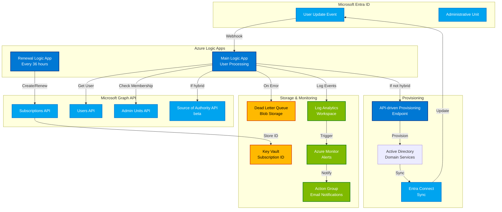
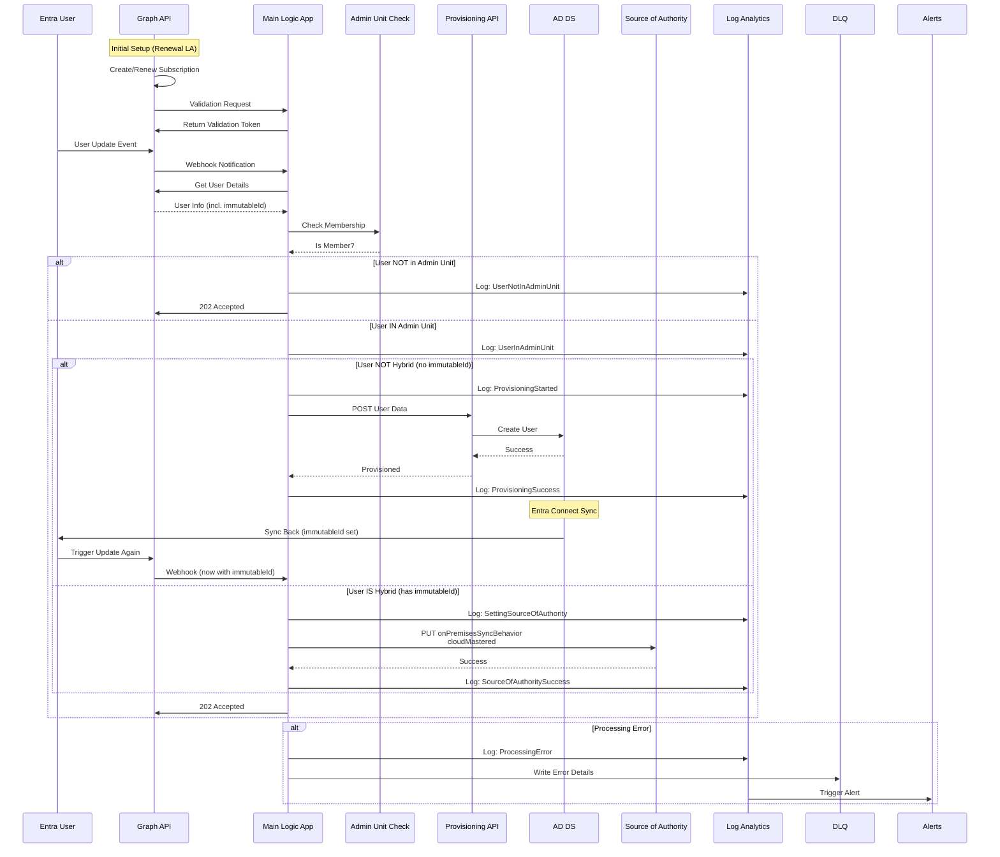
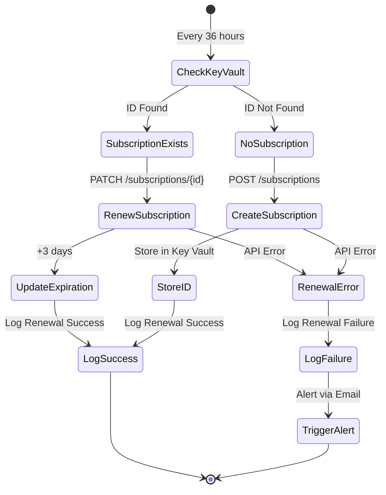
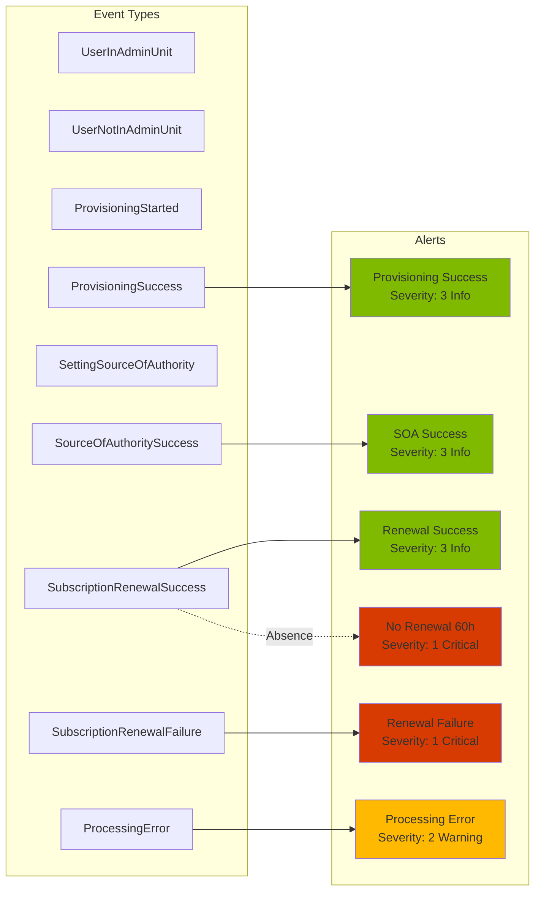
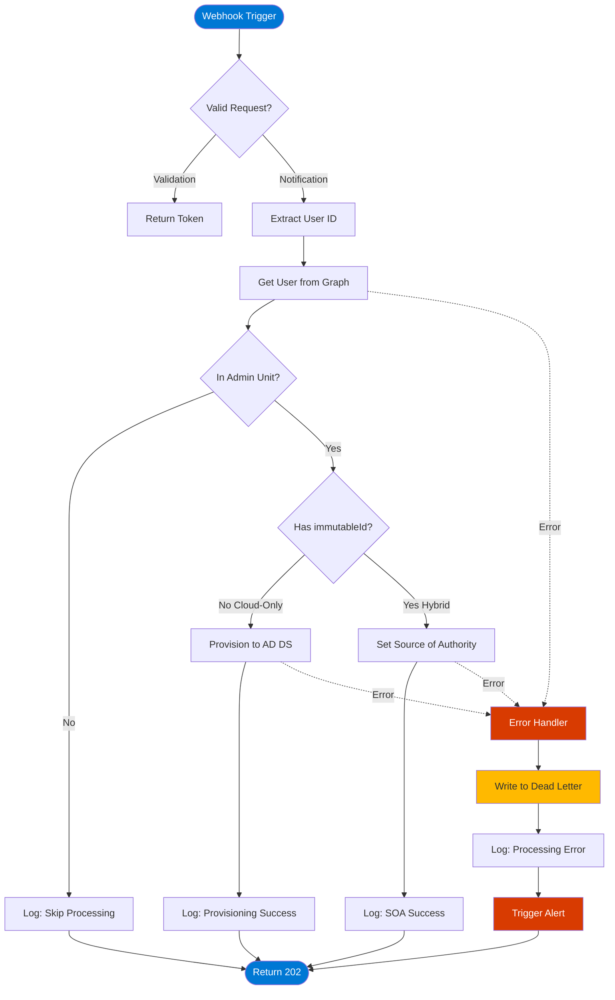

# Architecture Diagram

## System Overview

```mermaid
graph TB
    subgraph "Microsoft Entra ID"
        User[User Update Event]
        AdminUnit[Administrative Unit]
    end
    
    subgraph "Azure Logic Apps"
        MainLA[Main Logic App<br/>User Processing]
        RenewalLA[Renewal Logic App<br/>Every 36 hours]
    end
    
    subgraph "Microsoft Graph API"
        GraphSub[Subscriptions API]
        GraphUsers[Users API]
        GraphAU[Admin Units API]
        GraphSOA[Source of Authority API<br/>beta]
    end
    
    subgraph "Provisioning"
        ProvAPI[API-driven Provisioning<br/>Endpoint]
        ADDS[Active Directory<br/>Domain Services]
        AADConnect[Entra Connect<br/>Sync]
    end
    
    subgraph "Storage & Monitoring"
        KV[Key Vault<br/>Subscription ID]
        DLQ[Dead Letter Queue<br/>Blob Storage]
        LA[Log Analytics<br/>Workspace]
        Alerts[Azure Monitor<br/>Alerts]
        AG[Action Group<br/>Email Notifications]
    end
    
    %% Flows
    User -->|Webhook| MainLA
    RenewalLA -->|Create/Renew| GraphSub
    GraphSub -->|Store ID| KV
    
    MainLA -->|Get User| GraphUsers
    MainLA -->|Check Membership| GraphAU
    MainLA -->|If not hybrid| ProvAPI
    MainLA -->|If hybrid| GraphSOA
    MainLA -->|Log Events| LA
    MainLA -->|On Error| DLQ
    
    ProvAPI -->|Provision| ADDS
    ADDS -->|Sync| AADConnect
    AADConnect -->|Update| User
    
    LA -->|Trigger| Alerts
    Alerts -->|Notify| AG
    
    %% Styling
    classDef azure fill:#0078d4,stroke:#003087,stroke-width:2px,color:#fff
    classDef entra fill:#00a4ef,stroke:#0078d4,stroke-width:2px,color:#fff
    classDef storage fill:#ffb900,stroke:#d83b01,stroke-width:2px,color:#000
    classDef monitoring fill:#7fba00,stroke:#107c10,stroke-width:2px,color:#fff
    
    class MainLA,RenewalLA,ProvAPI azure
    class User,AdminUnit,GraphSub,GraphUsers,GraphAU,GraphSOA,AADConnect entra
    class KV,DLQ storage
    class LA,Alerts,AG monitoring
```

## Detailed Workflow

```mermaid
sequenceDiagram
    participant User as Entra User
    participant Graph as Graph API
    participant Main as Main Logic App
    participant AdminU as Admin Unit Check
    participant Prov as Provisioning API
    participant ADDS as AD DS
    participant SOA as Source of Authority
    participant Log as Log Analytics
    
    %% Subscription Creation
    Note over Graph: Initial Setup (Renewal LA)
    Graph->>Graph: Create/Renew Subscription
    Graph->>Main: Validation Request
    Main->>Graph: Return Validation Token
    
    %% User Update Flow
    User->>Graph: User Update Event
    Graph->>Main: Webhook Notification
    
    Main->>Graph: Get User Details
    Graph-->>Main: User Info (incl. immutableId)
    
    Main->>AdminU: Check Membership
    AdminU-->>Main: Is Member?
    
    alt User NOT in Admin Unit
        Main->>Log: Log: UserNotInAdminUnit
        Main->>Graph: 202 Accepted
    else User IN Admin Unit
        Main->>Log: Log: UserInAdminUnit
        
        alt User NOT Hybrid (no immutableId)
            Main->>Log: Log: ProvisioningStarted
            Main->>Prov: POST User Data
            Prov->>ADDS: Create User
            ADDS-->>Prov: Success
            Prov-->>Main: Provisioned
            Main->>Log: Log: ProvisioningSuccess
            
            Note over ADDS: Entra Connect Sync
            ADDS->>User: Sync Back (immutableId set)
            User->>Graph: Trigger Update Again
            Graph->>Main: Webhook (now with immutableId)
        else User IS Hybrid (has immutableId)
            Main->>Log: Log: SettingSourceOfAuthority
            Main->>SOA: PUT onPremisesSyncBehavior<br/>cloudMastered
            SOA-->>Main: Success
            Main->>Log: Log: SourceOfAuthoritySuccess
        end
        
        Main->>Graph: 202 Accepted
    end
    
    %% Error Handling
    alt Processing Error
        Main->>Log: Log: ProcessingError
        Main->>DLQ: Write Error Details
        Log->>Alerts: Trigger Alert
    end
```

## Subscription Renewal Flow

```mermaid
stateDiagram-v2
    [*] --> CheckKeyVault: Every 36 hours
    
    CheckKeyVault --> SubscriptionExists: ID Found
    CheckKeyVault --> NoSubscription: ID Not Found
    
    SubscriptionExists --> RenewSubscription: PATCH /subscriptions/{id}
    RenewSubscription --> UpdateExpiration: +3 days
    UpdateExpiration --> LogSuccess: Log Renewal Success
    
    NoSubscription --> CreateSubscription: POST /subscriptions
    CreateSubscription --> StoreID: Store in Key Vault
    StoreID --> LogSuccess: Log Renewal Success
    
    RenewSubscription --> RenewalError: API Error
    CreateSubscription --> RenewalError: API Error
    
    RenewalError --> LogFailure: Log Renewal Failure
    LogFailure --> TriggerAlert: Alert via Email
    
    LogSuccess --> [*]
    TriggerAlert --> [*]
```

## Event Types & Logging

```mermaid
graph LR
    subgraph "Event Types"
        E1[UserInAdminUnit]
        E2[UserNotInAdminUnit]
        E3[ProvisioningStarted]
        E4[ProvisioningSuccess]
        E5[SettingSourceOfAuthority]
        E6[SourceOfAuthoritySuccess]
        E7[SubscriptionRenewalSuccess]
        E8[SubscriptionRenewalFailure]
        E9[ProcessingError]
    end
    
    subgraph "Alerts"
        A1[Provisioning Success<br/>Severity: 3 Info]
        A2[SOA Success<br/>Severity: 3 Info]
        A3[Renewal Success<br/>Severity: 3 Info]
        A4[Processing Error<br/>Severity: 2 Warning]
        A5[Renewal Failure<br/>Severity: 1 Critical]
        A6[No Renewal 60h<br/>Severity: 1 Critical]
    end
    
    E4 --> A1
    E6 --> A2
    E7 --> A3
    E9 --> A4
    E8 --> A5
    E7 -.->|Absence| A6
    
    style A1 fill:#7fba00
    style A2 fill:#7fba00
    style A3 fill:#7fba00
    style A4 fill:#ffb900
    style A5 fill:#d83b01
    style A6 fill:#d83b01
```

## Data Flow

```mermaid
flowchart TD
    Start([Webhook Trigger]) --> Parse{Valid Request?}
    
    Parse -->|Validation| Return[Return Token]
    Parse -->|Notification| Extract[Extract User ID]
    
    Extract --> GetUser[Get User from Graph]
    GetUser --> CheckAU{In Admin Unit?}
    
    CheckAU -->|No| LogSkip[Log: Skip Processing]
    LogSkip --> End202([Return 202])
    
    CheckAU -->|Yes| CheckHybrid{Has immutableId?}
    
    CheckHybrid -->|No Cloud-Only| Provision[Provision to AD DS]
    Provision --> LogProv[Log: Provisioning Success]
    LogProv --> End202
    
    CheckHybrid -->|Yes Hybrid| SetSOA[Set Source of Authority]
    SetSOA --> LogSOA[Log: SOA Success]
    LogSOA --> End202
    
    GetUser -.->|Error| ErrorHandler
    Provision -.->|Error| ErrorHandler
    SetSOA -.->|Error| ErrorHandler
    
    ErrorHandler[Error Handler] --> DLQ[Write to Dead Letter]
    DLQ --> LogError[Log: Processing Error]
    LogError --> Alert[Trigger Alert]
    Alert --> End202
    
    style Start fill:#0078d4,color:#fff
    style End202 fill:#0078d4,color:#fff
    style ErrorHandler fill:#d83b01,color:#fff
    style DLQ fill:#ffb900
    style Alert fill:#d83b01,color:#fff
```
